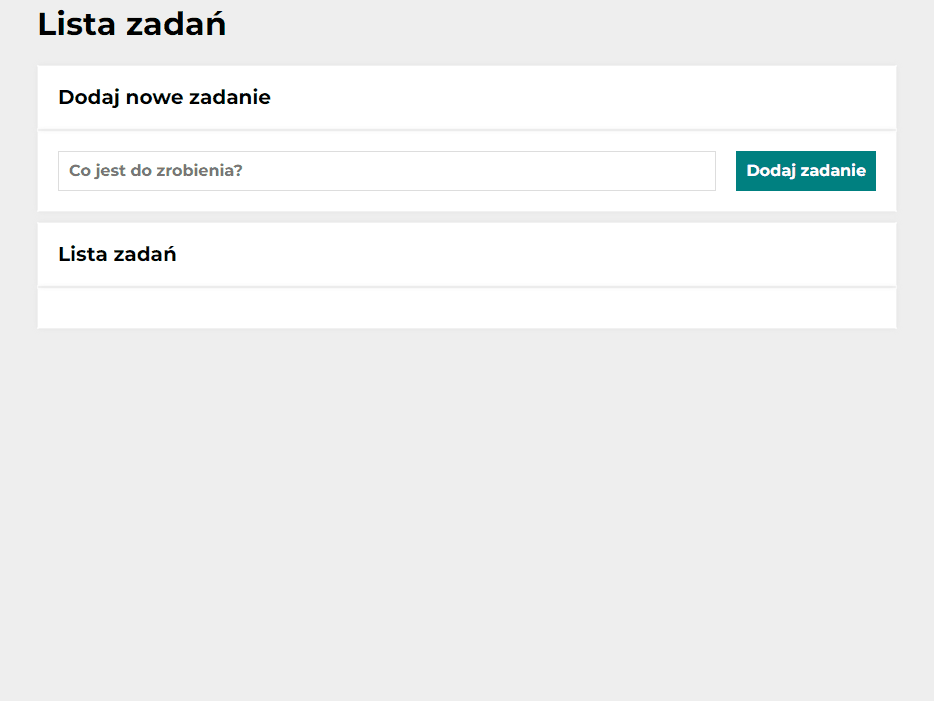

# DEMO: https://krzysztof-broniszewski.github.io/Todo-list-react/

# This is a Todo List in React.js, first project for course of JavaScript in YouCode course.
In future i will add the interactions, but now it was maked by the course lesson only. 

# Demo screen:

# Used technologies:
- React.js
- Node.js
- JavaScript ES6+
- HTML
- CSS
- Normalize.css
- BEM convension
- useState
- UseEffect
- Local Storage
- Styled Components
- theme

# Getting Started with Create React App

This project was bootstrapped with [Create React App](https://github.com/facebook/create-react-app).

# Demo video

