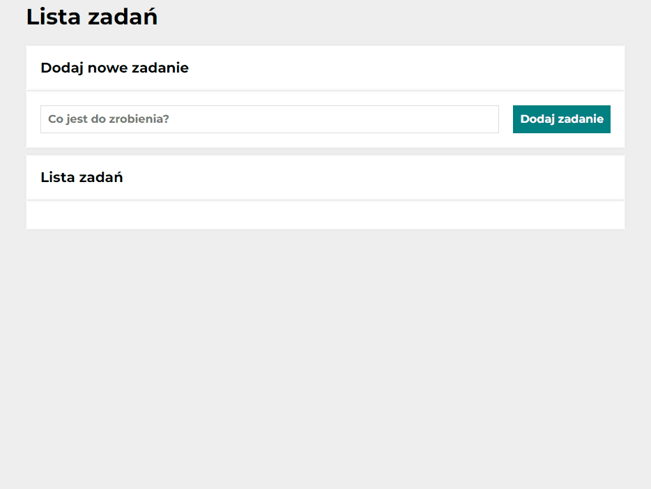

# 📝 Todo List — React + Redux + Saga

[](https://krzysztof-broniszewski.github.io/Todo-list-react/)


---

## 🔗 Demo
👉 **Live version:** [https://krzysztof-broniszewski.github.io/Todo-list-react/](https://krzysztof-broniszewski.github.io/Todo-list-react/)

This is a **Todo List app built in React.js**, originally started as part of the **YouCode JavaScript course**, and later expanded with modern technologies and Redux architecture.  
The app demonstrates handling asynchronous data, global state, theming, and persistent storage.

---

## ✨ Features
- Add, mark as done, hide, and remove tasks  
- Load **example tasks** with one click (various statuses)  
- Persistent data in **Local Storage**  
- **Theme switcher** (light / dark)  
- Modular architecture with **Redux Toolkit** style patterns  
- Asynchronous side effects handled by **Redux-Saga**  
- Navigation handled by **React Router**

---

## 🧰 Tech stack & libraries

| Category | Technologies |
|-----------|---------------|
| **Core** | React 18, JavaScript ES6+, Node.js |
| **State management** | Redux, Redux-Saga, React-Redux (`useSelector`, `useDispatch`), Reducers, Actions, Store |
| **Routing** | React Router 6 |
| **UI / Styling** | Styled Components, Normalize.css, BEM convention |
| **Data & Logic** | Generators, Custom Hooks, Local Storage API |
| **Project structure** | `features/`, `common/`, `store/`, `configureStore.js` |
| **Other tools** | Create React App, npm scripts, import JSON data (`exampleTasks.json`) |

---

## 🖥️ Demo preview




This project was bootstrapped with [Create React App](https://github.com/facebook/create-react-app).

---

## 🚀 Getting started (local development)

```bash
# Clone the repo
git clone https://github.com/Krzysztof-Broniszewski/Todo-list-react.git
cd Todo-list-react

# Install dependencies
npm install

# Start local server
npm start
# App will open at http://localhost:3000/

# Build for production
npm run build